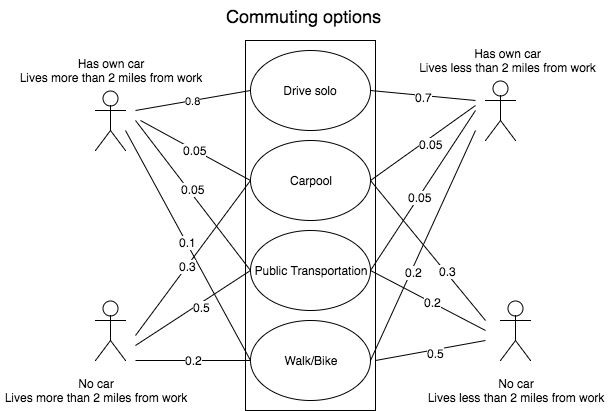

## Smart City Transportation Model - User Case Diagram

The following is a User Case Diagram for commuters in a city. As we can see the major diferences in users is few. The possession of a car and location of residence in comparison to work.

This type of diagram is arguably the most important in this system because it contains the information we are most interested in. The central goal is to focus on the users that have cars. If we are able to lower the probality that someone with their car will drive solo to work, congestion is expected to clear.