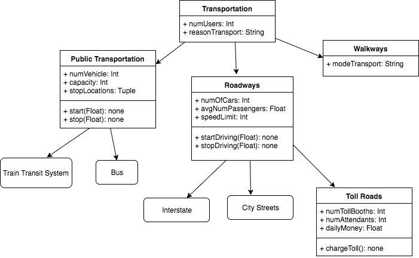

## Smart City Transportation Model - Class Diagram

This is a class diagram for the inter-city transportation model.

Most notably, we are interested in commuters choosing to use roadways to get to work. Our goal is to lower the number of solo drivers on the road, therefore we do not care much about the type of transportation that is substituted. We may see a higher use of public transportation, more commuters walking or biking on the walkways, or carpooling. The main attribute we will focus on is avgNumPassengers in the Roadways class. If the average number of passengers on the roadways is increasing, we can begin to assume the number of solo drivers is decreasing.