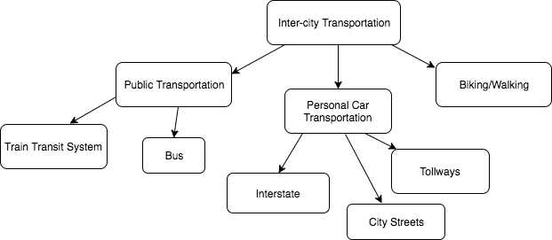

## Smart City Transportation Model - Object Diagram

This is an object diagram describing the most popular types of transportation within a city.

Depending on the city at hand, some of these categories may not exist. For example, travel around the Gainesville area does not include a train transit system, tollways, or much interstate/freeway travel. Where as Orlando travel includes all types included in this diagram apart from a train transit system.